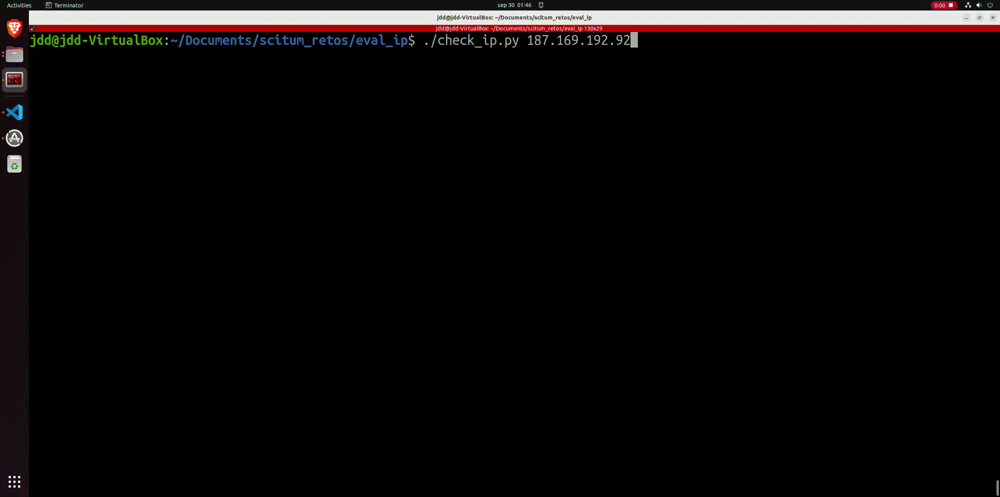
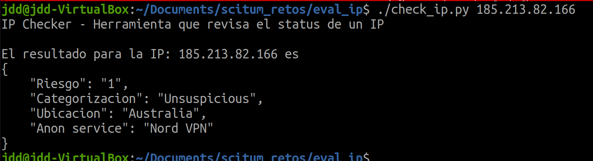
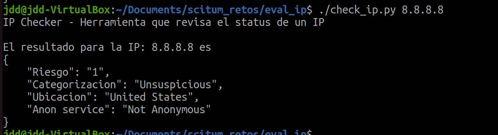
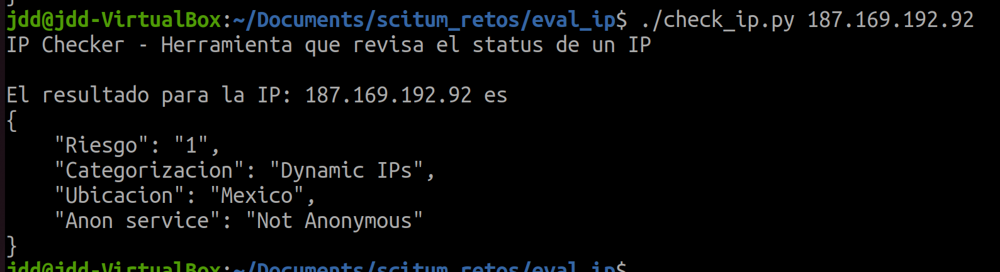

# IP Checker

Este script en python evalua mediante scraping una ip para determinar su origen y si pertenece a algun servicio de anonimato

Realiza un script en python que solicite al usuario una dirección IP y realice scraping para obtener 

* Riesgo
* Categorización
* Ubicación
* ¿Pertenece a algún servicio de anonimato?



# Install
El script se probo en la ultima version de Ubuntu con el driver de FireFox

Antes de usar el script se necesita instalar lo siguiente
* BeautifulSoup4
* requests
* selenium

```bash
python3 -m pip install BeautifulSoup4
python3 -m pip install requests
python3 -m pip install selenium
```

# How does it work
El sitio web que se consulta [https://exchange.xforce.ibmcloud.com/](https://exchange.xforce.ibmcloud.com/) es un sitio web dinamico es decir, se apoya de JS para cargar su contenido no podemos usar un simple request por que solo nos trae el contenido limitado, para esto usamos selenium que con un web driver nos carga todo el sitio completo de manera dinamica

Posteriormente usamos BeautifulSoup4 para parsear el HTML y poder encontrar los elementos en el sitio web

Postriormente hacemos otra consulta al sitio [https://spur.us/context](https://spur.us/context) para saber si se tiene un servicio de anonimato.

Al final el script nos entrega un reporte de la IP dada en formato JSON

# Usage
```bash
Usage: ./check_ip.py <IP>

:~./check_ip.py 8.8.8.8
```

# Examples



